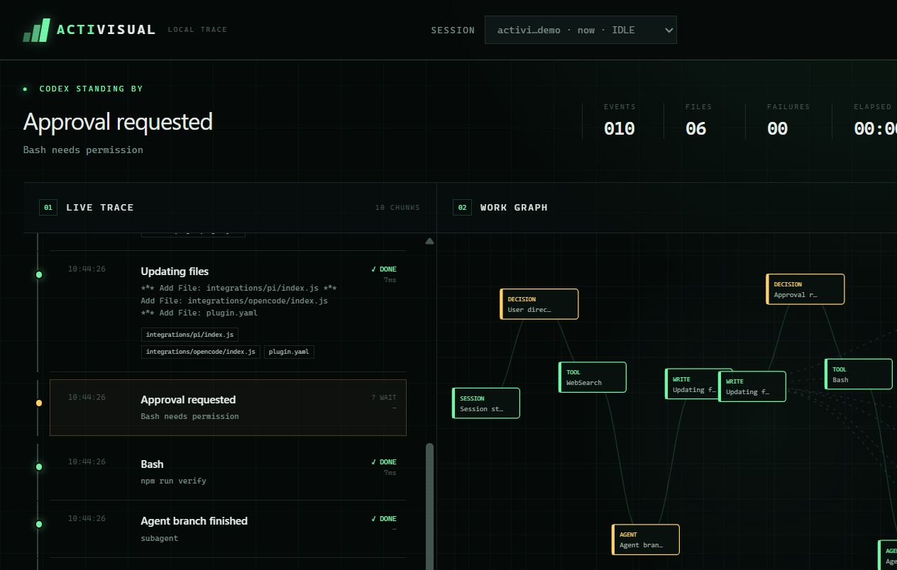

# Activisual

**See what your coding agent is doing—live, locally, and without sending its trace anywhere.**

[](https://github.com/bardia-sneyes/activisual/actions/workflows/ci.yml)


Activisual turns agent lifecycle events into a readable timeline and a relationship graph of prompts, tools, decisions, subagents, tests, builds, git operations, and files. It supports **Codex, Claude Code, Pi, OpenCode, and Hermes Agent** from one small npm package.



## Quick start

Node.js 20 or newer is required. From the project you want to observe:

```bash
npx --yes activisual@latest install --harness all
npx --yes activisual@latest start
```

The installer preserves existing configuration and is safe to run again. Project scope is the default; use `--global` to configure user-wide integrations. Hermes plugins are always user-scoped because that is where Hermes loads third-party plugins.

The dashboard opens at `http://127.0.0.1:4319`. Restart the relevant harness after installation. Codex and Claude Code also require you to review newly added hooks with `/hooks` before trusting them.

## Install one harness

Each command is project-local unless marked otherwise.

| Harness | One-command install | What Activisual configures |
| --- | --- | --- |
| Codex | `npx --yes activisual@latest install --harness codex` | `.codex/hooks.json` plus a dependency-free hook runtime |
| Claude Code | `npx --yes activisual@latest install --harness claude` | `.claude/settings.json` plus a dependency-free hook runtime |
| Pi | `npx --yes activisual@latest install --harness pi` | Adds `npm:activisual` to `.pi/settings.json` |
| OpenCode | `npx --yes activisual@latest install --harness opencode` | Adds `activisual` to `opencode.json`; OpenCode installs the npm plugin |
| Hermes Agent | `npx --yes activisual@latest install --harness hermes` | Installs and enables `~/.hermes/plugins/activisual` |

Aliases `claude-code` and `open-code` are accepted. To install several harnesses at once, pass a comma-separated list such as `--harness codex,pi`; to install all of them, use `--harness all`.

```bash
# User-wide Codex, Claude Code, Pi, and OpenCode configuration
npx --yes activisual@latest install --harness all --global

# Observe a project other than the current directory
npx --yes activisual@latest start --project /path/to/project --port 4320
```

### Native package-manager routes

The repository also ships the native manifests expected by each ecosystem: `.codex-plugin/plugin.json`, `.claude-plugin/plugin.json`, `pi.extensions`, the OpenCode npm export, and Hermes `plugin.yaml`.

```bash
# Pi
pi install npm:activisual

# Hermes Agent
hermes plugins install bardia-sneyes/activisual --enable

# Claude Code marketplace
claude plugin marketplace add bardia-sneyes/activisual
claude plugin install activisual@activisual
```

For Codex, add this repository as a plugin marketplace and install Activisual from the Plugins directory. The `npx` installer remains the shortest path and works before marketplace listing.

## What you get

- A live trace that pairs tool start/end events into meaningful work chunks with duration and outcome.
- A work graph connecting prompts, approvals, tools, agents, and files inside the tracked project.
- Clear build, test, git, write, failure, decision, and agent-branch states.
- Saved local sessions, replay controls, a detail inspector, and explicit session deletion.
- Cross-harness event normalization, so one dashboard model works across different hook APIs.

Activisual is an observer, not an enforcement boundary. Harnesses expose different lifecycle events, and hosted tools that bypass local hooks may not appear in the trace.

## Privacy by default

- Hooks append compact events to `<project>/.activisual/events.jsonl`; no cloud service or telemetry is involved.
- The dashboard listens on `127.0.0.1` only.
- Common secret keys, bearer tokens, API keys, private keys, connection strings, and secret-bearing environment values are redacted before persistence.
- Large strings and collections are truncated; transcript paths and full conversation transcripts are not stored.
- Events older than 30 days are pruned at startup, and only the 50 most recent sessions are retained.
- Hook adapters fail open: Activisual cannot block the coding agent if its dashboard is stopped.

These controls reduce accidental exposure but do not replace a dedicated secret scanner. Avoid placing secrets directly in prompts or command arguments.

## How it works

```text
Harness lifecycle event
  -> native hook/plugin adapter
  -> redact + normalize + append JSONL
  -> localhost server and session reducer
  -> JSON API + server-sent events
  -> live timeline, graph, inspector, and replay
```

Codex and Claude Code use command-hook manifests. Pi and OpenCode load the JavaScript adapters exported by the npm package. Hermes loads the Python plugin from its user plugin directory. All adapters produce the same compact event envelope.

See [the architecture notes](docs/architecture.md) for the storage model, grouping rules, API, and current limits.

## Command reference

```text
activisual install [--harness NAME|all] [--project PATH] [--global]
activisual start [--project PATH] [--port 4319] [--no-open]
```

`install` defaults to Codex. `start` defaults to the current directory and opens a browser unless `--no-open` is supplied.

## Development

```bash
npm install
npm run verify
npm pack --dry-run
npm link
```

`npm run verify` performs syntax checks, integration/config matching tests, server tests, and package-manifest validation. CI runs the same verification on Node 20, 22, and 24 on both Linux and Windows.

## Publishing

Releases are tokenless. npm trusts `.github/workflows/release.yml` through GitHub OIDC, and the workflow publishes the public package with provenance before creating a GitHub release containing the exact tarball.

The npm trusted publisher is configured for GitHub user `bardia-sneyes`, repository `activisual`, workflow `release.yml`, and the `npm publish` action. No `NPM_TOKEN` secret is required.

To release a version, update the version in `package.json`, `package-lock.json`, `.claude-plugin/plugin.json`, `.codex-plugin/plugin.json`, and `plugin.yaml`; run `npm run verify`; then push a matching `vX.Y.Z` tag. The workflow rejects mismatched tags and package versions.

## License

MIT
